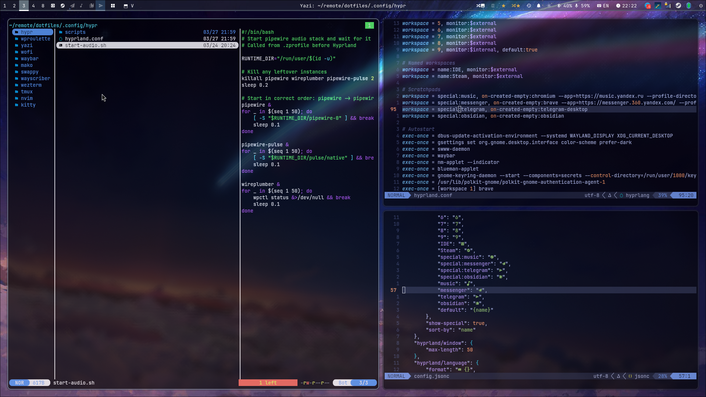

# Dotfiles



Hyprland + Waybar setup with transparent windows, nerd font icons, smart monitor management, and a unified dark theme across all components.

All hardware-specific values (monitor names, resolutions, opacity, bluetooth devices) are configurable via variables at the top of `hyprland.conf` — no need to hunt through the config.

# Instructions

## 1. Requirements
- zsh
- kitty or wezterm (terminal)
- oh-my-zsh
- neovim (using Lazy.nvim for plugins)
- tmux+tpm
- git
- zsh-autoswitch-virtualenv

## 2. One of many ways to replicate setup
```shell
git clone --bare https://github.com/v-dermichev/dotfiles.git $HOME/.dotfiles
alias dotfiles='/usr/bin/git --git-dir="$HOME/.dotfiles/" --work-tree="$HOME"'
dotfiles checkout
dotfiles config --local status.showUntrackedFiles no
```

## 3. Hyprland + Waybar Setup (Artix/Arch)

> **Note:** This setup is systemd-free. All services use OpenRC, elogind, udev rules, and shell scripts instead of systemd units/timers.
>
> **Privacy:** systemd merged a `birthDate` field into its userdb records ([PR #40954](https://github.com/systemd/systemd/pull/40954)) for age verification compliance. elogind is unaffected — it only handles login sessions and power management, and does not include systemd's userdb/homectl components where the DOB field lives.

### Packages
```shell
# Core
pacman -S hyprland waybar wofi grim slurp swappy mako socat jq qt6-wayland

# Screenshot & annotation
pacman -S hyprshot satty
yay -S wayscriber-bin

# Audio
pacman -S pipewire pipewire-pulse wireplumber

# Bluetooth
pacman -S bluez bluez-utils blueman

# Notification sounds
pacman -S libcanberra sound-theme-freedesktop

# System monitor
pacman -S mission-center

# Clipboard
pacman -S wl-clipboard cliphist

# Fonts
pacman -S ttf-jetbrains-mono-nerd noto-fonts-emoji

# NVIDIA (skip if not using NVIDIA)
pacman -S nvidia-open-dkms nvidia-utils

# Wallpaper
pacman -S swww

# Audio control
pacman -S pavucontrol

# Session & power
pacman -S elogind dbus

# Terminal (kitty is default in hyprland.conf)
pacman -S kitty

# Other
pacman -S brightnessctl network-manager-applet gnome-keyring
```

> **Hardware-specific:** Edit variables at the top of `hyprland.conf` to match your hardware:
> - `$internal` / `$external` — monitor names (run `hyprctl monitors` to find yours)
> - `$internalMode` / `$externalMode` — resolutions and refresh rates
> - `$btDevices` — bluetooth MAC address(es), space-separated
> - `$screenshotDir` — where screenshots and recordings are saved
> - `$activeOpacity` / `$inactiveOpacity` — window transparency levels

### System config (not in dotfiles)

**NVIDIA + Intel hybrid (modprobe)** — `/etc/modprobe.d/nvidia.conf`:
```
options nvidia_drm modeset=1 fbdev=1
```

**GRUB kernel params** — add to `GRUB_CMDLINE_LINUX_DEFAULT` in `/etc/default/grub`:
```
nvidia-drm.modeset=1 nvidia_drm.fbdev=1
```
Then run `grub-mkconfig -o /boot/grub/grub.cfg`.

**NVIDIA initramfs modules** — in `/etc/mkinitcpio.conf`:
```
MODULES=(i915 nvidia nvidia_modeset nvidia_uvm nvidia_drm)
```

**NVIDIA runtime PM (AC/battery switch)** — `/etc/udev/rules.d/90-nvidia-power.rules`:
```
SUBSYSTEM=="power_supply", ATTR{online}=="1", RUN+="/usr/local/bin/nvidia-power-switch.sh"
SUBSYSTEM=="power_supply", ATTR{online}=="0", RUN+="/usr/local/bin/nvidia-power-switch.sh"
```
With `/usr/local/bin/nvidia-power-switch.sh`:
```bash
#!/bin/bash
NVIDIA_PM="/sys/bus/pci/devices/0000:01:00.0/power/control"
AC_ONLINE="/sys/class/power_supply/ADP1/online"
[ -f "$NVIDIA_PM" ] || exit 0
[ -f "$AC_ONLINE" ] || exit 0
if [ "$(cat "$AC_ONLINE")" = "1" ]; then
    echo "on" > "$NVIDIA_PM"
else
    echo "auto" > "$NVIDIA_PM"
fi
```

**Bluetooth auto-reconnect** — uncomment in `/etc/bluetooth/main.conf` `[Policy]`:
```
AutoEnable=true
ReconnectAttempts=7
ReconnectIntervals=1,2,4,8,16,32,64
```

**Pipewire realtime scheduling** — `/etc/security/limits.d/99-audio.conf`:
```
@audio - rtprio 95
@audio - nice -19
@audio - memlock unlimited
```
Add your user to the `audio` group: `gpasswd -a $USER audio`

### Wallpaper Roulette

Waybar includes 4 wallpaper controls (left to right):

1. **Random** (shuffle+image icon) — pick a random wallpaper from `~/Pictures/Wallpapers/`, excluding trashed
2. **Trash** (bin icon) — move current wallpaper to `.trash/` and pick a new one. Grayed out when starred
3. **Star** (star icon) — toggle star on current wallpaper. Dimmed when unstarred, golden when starred
4. **Starred Random** (shuffle+star icon) — pick a random wallpaper from starred favorites only

Workflow: spam random to browse, trash the bad, star the good, then use starred random to enjoy favorites.

State is stored in `~/Pictures/Wallpapers/.starred` (list of paths) and `.trash/` (discarded images). Uses `swww` for smooth fade transitions.

### Notes

- `.zprofile` starts pipewire before Hyprland so all apps have audio immediately
- The `--systemd` flag in `dbus-update-activation-environment` is misleadingly named — it just exports env vars to the D-Bus activation environment, works with elogind, no systemd required
- NVIDIA runtime PM script paths (`0000:01:00.0`, `ADP1`) are hardware-specific — adjust for your system

### Common Problems

**JetBrains IDEs flickering/artifacts** — Switch to native Wayland rendering by adding `-Dawt.toolkit.name=WLToolkit` to the IDE's `vmoptions` file (Help → Edit Custom VM Options). XWayland causes focus-stealing and rendering issues with Hyprland.

**Thunar can't mount drives** — Install `polkit-gnome` and add to autostart: `exec-once = /usr/lib/polkit-gnome/polkit-gnome-authentication-agent-1`

**Thunar "Unable to find terminal"** — Install `xdg-terminal-exec` (`yay -S xdg-terminal-exec`) and create `~/.config/xdg-terminals.list` with your terminal name (e.g. `kitty`).

**Chromium won't start** — Stale `SingletonLock` file from a crash. Remove `~/.config/chromium/SingletonLock`.

**No notification sounds** — Mako doesn't play sounds. The included `notification-sound.sh` script handles this via D-Bus monitoring. Toggle on/off via the bell icon in waybar.

**Bluetooth headset won't auto-connect at boot** — The included `bt-autoconnect.sh` handles this. Set `$btDevices` in `hyprland.conf` to your device MAC(s). Sony/similar headsets need the host to initiate — BlueZ `AutoEnable` alone isn't enough.

**Internal monitor keeps re-enabling** — `hyprctl keyword monitor` is a runtime override that doesn't survive DPMS/suspend cycles. The included `monitor-watcher.sh` listens to Hyprland events and re-enforces the disable.
